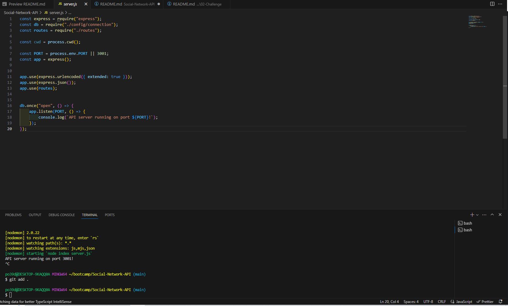
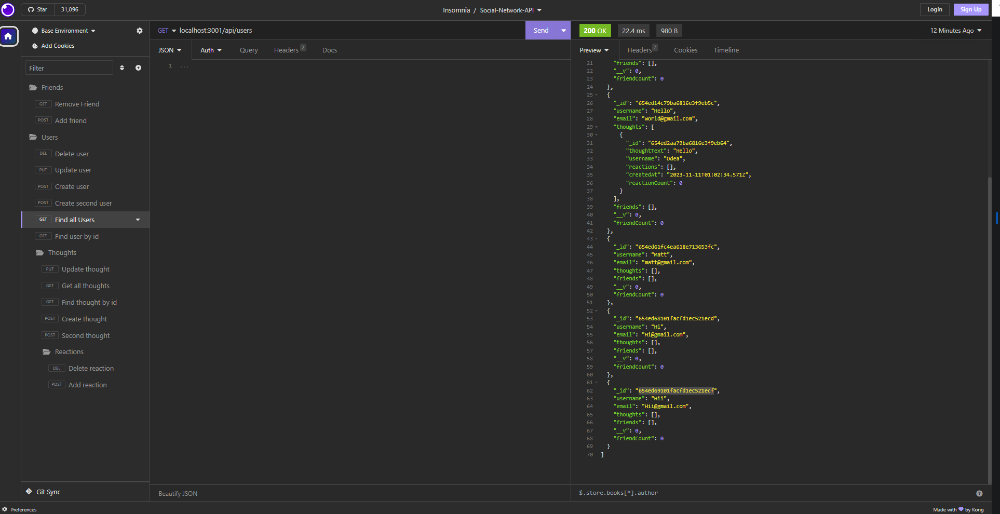

# Social-Network-API

## Live Screen Recording

https://drive.google.com/file/d/1Q6DAXa_38WvzxCg3T0g7Dv7pWgWK65QP/view

## Description
This application is an API for a social network web app where users can share their thoughts, react to friends’ thoughts, and create a friend list.

## Usage
As of now the usage of this application can be conducted through spinning up the server with npm run start or nodemon with npm run dev, then heading over to an application like Insomnia or Postman and testing different API end points. For further information on starting up the server, MongoDB Compass and MongoDB installation navigate to the Installation section above.